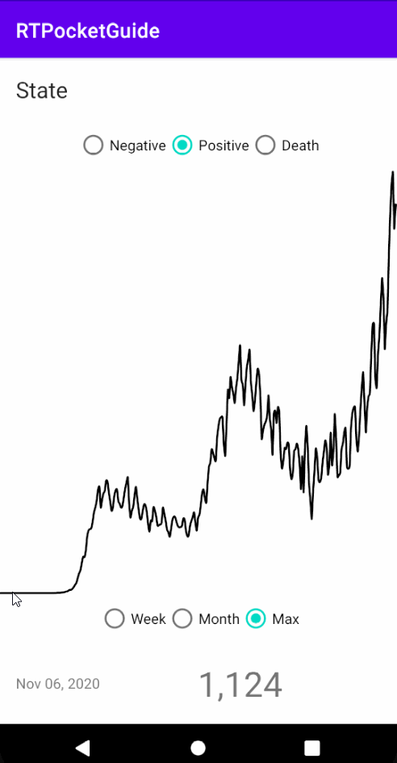

# Respiratory Therapist Helper

RT Helper automates some calculations for Respiratory Therapists, which would normally be done by hand. The app also includes a handy interactable chart which shows both state-wide and national COVID-19 data.

## Part 1 - Chart

### User Stories

- [x] User can view chart containing COVID-19 data.
- [x] User can view data by time scale.
  - [x] To date
  - [x] This month
  - [x] This week
- [x] User can view the following data:
  - [x] Positive cases
  - [x] Negative cases
  - [x] Deaths
- [x] User can interact with the chart.
- [x] User can view national data.
- [ ] User can view state-wide data.
- [ ] User can select state from a Spinner.
- [ ] App has been properly styled.

### Video Walkthrough

Here's a walkthrough of implemented user stories:

### Open-source libraries used

- [Retrofit](https://square.github.io/retrofit/) - A type-safe HTTP client for Android and Java
- [Glide](https://github.com/bumptech/glide) - Image loading and caching library for Android
- [GSON](https://github.com/google/gson) - Gson is a Java library that can be used to convert Java Objects into their JSON representation
- [Spark](https://github.com/robinhood/spark) - A simple Android sparkline chart view.

### License

    Copyright twentytwenty me

    Licensed under the Apache License, Version 2.0 (the "License");
    you may not use this file except in compliance with the License.
    You may obtain a copy of the License at

        http://www.apache.org/licenses/LICENSE-2.0

    Unless required by applicable law or agreed to in writing, software
    distributed under the License is distributed on an "AS IS" BASIS,
    WITHOUT WARRANTIES OR CONDITIONS OF ANY KIND, either express or implied.
    See the License for the specific language governing permissions and
    limitations under the License.
